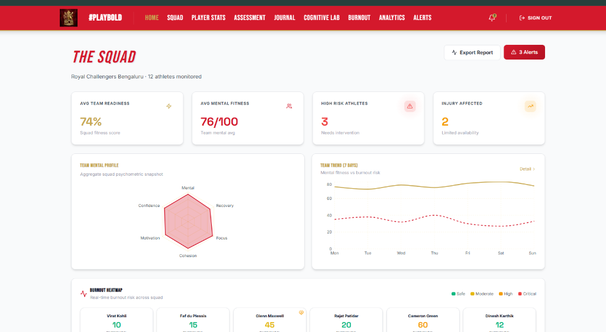
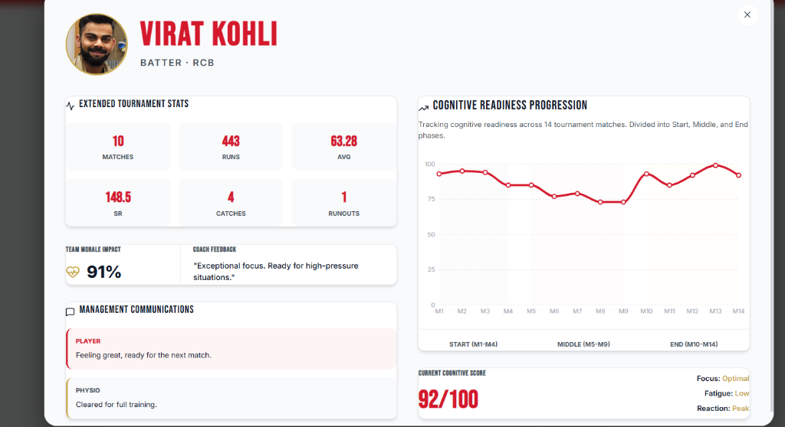
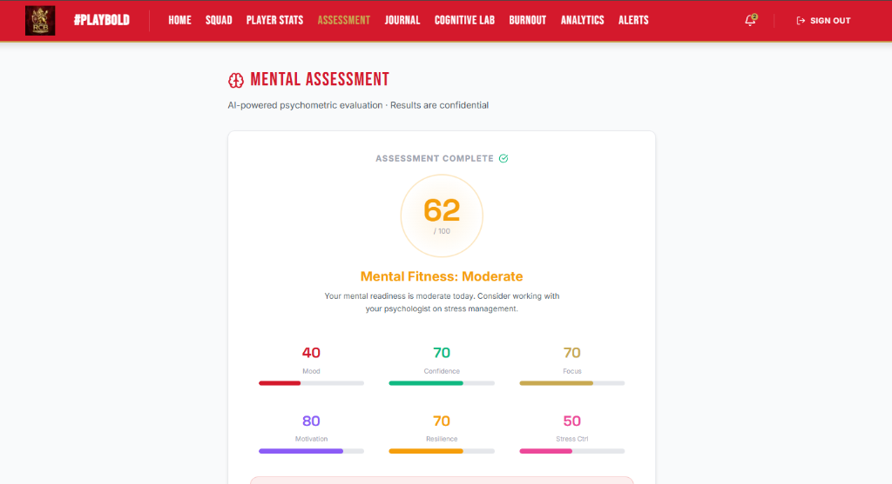
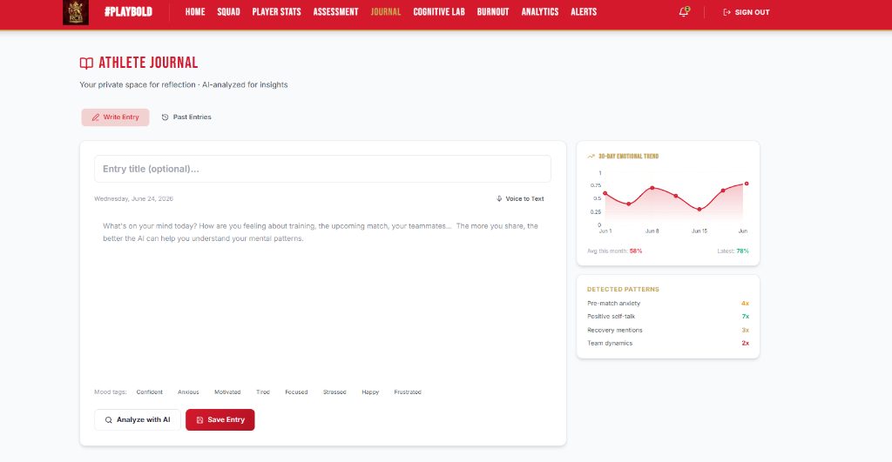
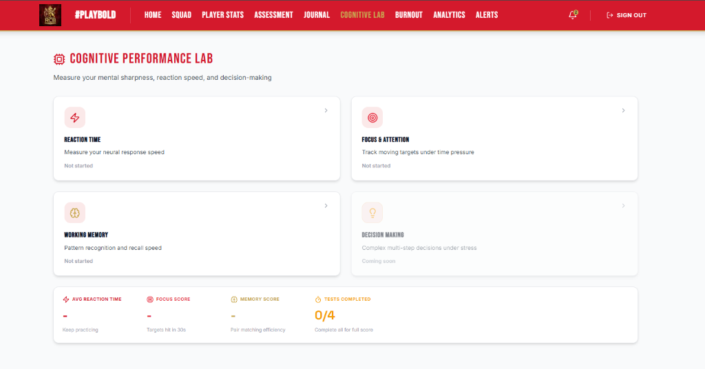

# ATHLON AI – Athlete Mental Fitness & Performance Intelligence

A production-ready web application for sports teams, academies, and professional organizations that combines psychometric assessments, AI-powered mental health analysis, performance tracking, workload monitoring, and predictive analytics to improve athlete readiness and well-being.

## Features

- **Mental & Cognitive Tracking**: Regular psychometric assessments and cognitive reaction labs.
- **Coach Dashboard**: Aggregated team readiness, mental fitness averages, and burnout heatmaps.
- **Advanced Player Analytics**: Detailed, interactive slide-up modals featuring tournament performance stats, cognitive progression graphs, and management communication logs.
- **AI Athlete Journal**: A private journal space for players with AI-driven emotional trend analysis.

## Screenshots

### Coach Dashboard Overview

*The main coach dashboard showing team readiness, high-risk athletes, and the burnout heatmap.*

### Advanced Squad Analytics Modal

*Detailed player view with extended stats, team morale impact, and an interactive cognitive progression graph mapping the player's readiness across the tournament.*

### Athlete Mental Assessment

*AI-powered psychometric evaluation interface providing instant mental fitness scores and confidence levels.*

### AI-Analyzed Athlete Journal

*A private reflection space for athletes featuring a 30-day emotional trend graph and AI-detected psychological patterns.*

### Cognitive Performance Lab

*Interactive lab designed to measure mental sharpness, reaction time, working memory, and focus under pressure.*

## Getting Started

1. Clone the repository.
2. Run `npm install`
3. Run `npm run dev` to start the development server at `http://localhost:3000`.
